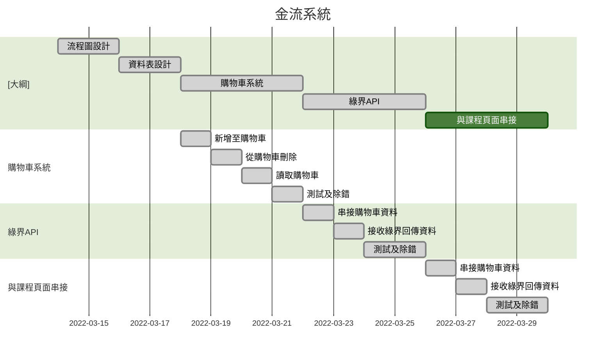

```mermaid
gantt
    title 金流系統
    dateFormat  YYYY-MM-DD
    excludes weekends
    %%{init: {'theme': 'forest'} }%%

    section [大綱]
    excludes    days
    流程圖設計     :done, a1, 2022-03-14, 2d
    資料表設計     :done, a2, after a1, 2d
    購物車系統     :done, a3, after a2, 4d
    綠界API       :done, a4, after a3, 4d
    與課程頁面串接  :,after a4  , 4d
 
    section 購物車系統
    excludes    days
    新增至購物車   :done, b2, after a2, 1d
    從購物車刪除   :done, b3, after b2, 1d
    讀取購物車     :done, b4, after b3, 1d
    測試及除錯     :done, b5, after b4, 1d
    
    section 綠界API
    excludes    days
    串接購物車資料   :done, c2, after b5, 1d
    接收綠界回傳資料 :done, c3, after c2, 1d
    測試及除錯     :done, c4, after c3, 2d

    section 與課程頁面串接
    excludes    days
    串接購物車資料   :done, d2, after c4, 1d
    接收綠界回傳資料 :done, d3, after d2, 1d
    測試及除錯     :done, d4, after d3, 2d
    
```

