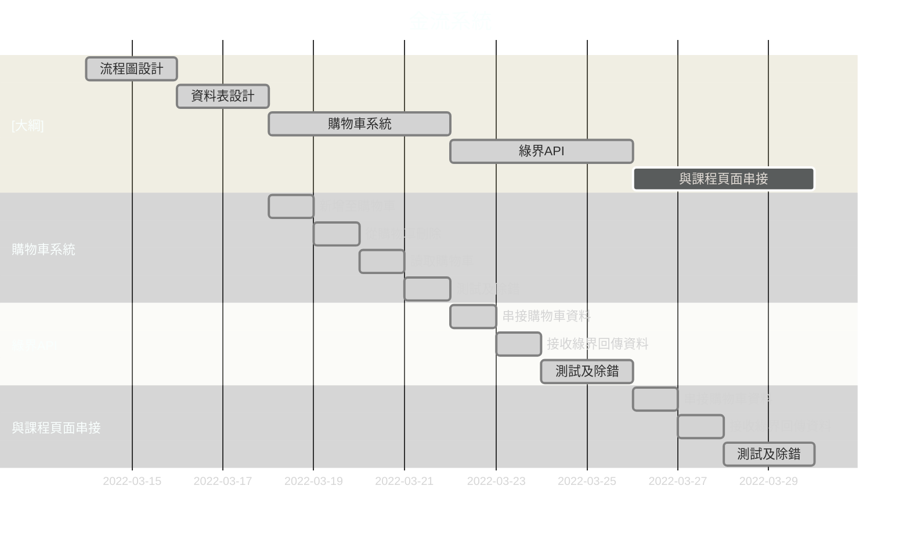

# 購物車
[](https://mermaid.live/edit#pako:eNqllE9r2zAYh7-KEIRcHGgc7-LbIB3sUCjsNOYdVEtpzRJ72DJbCYF1l2RdaRlsgbI1tKXd0rI_bUNDoWOfZrLlbzE5cuQ4lBKYwSDk3yO9jySrDW0PE2jCdeRSarlAPNShTQKS7ofoeise3cbXl7IfI0oeeX4LUQCeiqeyslKp1-U38tpuhpgE4BUhL4iLA9ldKrUd16EmaJfpBmmRsgnKDc8nAS13QKdUslyZC4hNHc8Fz9jJt3h8-Xxu0Mnkm9mYaVXD9-xLnw9_8GEv7QIm9lyiAVTVgL6k65WlWqVqiDaWCB91o_4-PxregejibVDiS1gBv-N3Z_x2W_oXgJoCBGpkQDw-jD_tPFx9DEAhbKhwLQ_zXpefXwmJ5HArOTj-e3MV7Z4KRsuiBgBZuLg6c1Xdu0j9C3Y84N2RYvKi1vRZg2pWFPszUFnWO0_2T2YI5bw2Q_Cfb9hef3aCHFDeKToFopvv_Owr29sWgyc7vwrAAwUYOVDUV2t8n7hcTFWU3Pl8Hlu5pzOqwnZPo49jOT77PGBvRxk3pZS_rS-kYyv_FE1P1dxO3nUC_kMLKy3bWFwLKy28mBZWWniiBTXYIuJCcLC4QdopbsHJf25BUzQxaaCwSS1ouR0RDV-mN8gydqjnQ7OBmgHRIAqp92TTtaFJ_ZBMQ3UHrfuolaU6_wCwANyk)

<!-- 

-->

# 購物車２
56789
## 購物車3
789456123